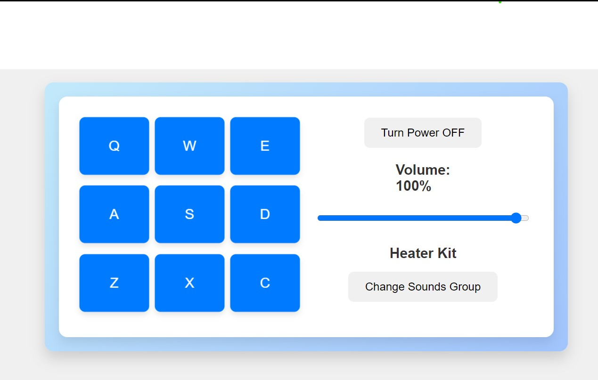

# Drum Machine 🎵

## Project Description 🧠

### 🎨 **Drum Machine**

This React-based Drum Machine application allows users to create beats and control audio with various drum sounds. The app features interactive drum pads that can be triggered using either mouse clicks or keyboard keys. Users can toggle power, adjust volume, and switch between different sound kits. Designed with a clean and modern interface, it ensures a fun and engaging experience for beat-making.

## [Live Demo](https://markdown-previewer-dvjl-4scuzoxej-shogofs-projects.vercel.app/) 🎥

## Demo 📸



## Technologies Used 🛠️

- [React](https://reactjs.org/): JavaScript library for building user interfaces.
- [HTML5 Audio API](https://developer.mozilla.org/en-US/docs/Web/API/HTMLAudioElement): Manages audio playback and volume control.
- [CSS](https://developer.mozilla.org/en-US/docs/Web/CSS): Custom styles for the application.

## Installation 💻

To set up the project locally, follow these steps:

1. **Clone the repository:**

   ```bash
   git clone https://github.com/shogof/drum-machine-p/tree/drum-machine
   ```

2. **Navigate to project directory:**

   ```bash
   cd drum-machine-p
   ```

3. **Install dependencies:**

   ```bash
   npm install
   ```

4. **Start the development server:**

   ```bash
   npm start
   ```

   Open `http://localhost:3000` in your web browser to view the app.

## Usage 🎯

1. **Play Sounds:**
   Click on the drum pads or press the corresponding keyboard keys (`Q`, `W`, `E`, `A`, `S`, `D`, `Z`, `X`, `C`) to play sounds.

2. **Toggle Power:**
   Use the "Turn Power OFF" / "Turn Power ON" button to enable or disable the drum machine.

3. **Adjust Volume:**
   Use the volume slider to set the desired sound level.

4. **Switch Sound Kits:**
   Click the "Change Sounds Group" button to switch between the Heater Kit and Smooth Piano Kit.

## Code Overview 📂

### `App.js`

- **State Management:**
  - `power`: Manages whether the drum machine is on or off.
  - `volume`: Controls the volume of the drum sounds.
  - `soundName`: Displays the name of the currently played sound.
  - `soundType`: Determines the current sound kit.
  - `sounds`: Contains the list of sounds for the current sound kit.

- **Functions:**
  - `play`: Plays a sound when a drum pad is clicked or a key is pressed.
  - `stop`: Toggles the power state of the drum machine.
  - `changeSoundGroup`: Switches between different sound kits.
  - `handleVolumeChange`: Adjusts the volume of the sounds.

### `Keyboard.js`

- **Displays the drum pads** and handles user interactions for playing sounds.

### `DrumControl.js`

- **Provides controls** for toggling power, adjusting volume, and changing sound kits.

### `KeyboardKey.js`

- **Represents individual drum pads** and manages keyboard events for sound playback.

## Author 👩‍💻

- **LinkedIn:** [LinkedIn Profile](www.linkedin.com/in/shegofa-developer-aa362030b)
- **Email:** [shogofadeveloper12@gmail.com](mailto:shogofadeveloper12@gmail.com)
- **GitHub:** [GitHub Profile](https://github.com/shogof)

## Contributing 🤝

Contributions are welcome! If you’d like to contribute, please follow these steps:

1. **Fork the repository** on GitHub.
2. **Clone your fork** to your local machine:

   ```bash
   git clone https://github.com/shogof/drum-machine-p/tree/drum-machine
   ```

3. **Create a new branch** for your changes:

   ```bash
   git checkout -b feature/your-feature
   ```

4. **Make your changes** and **commit** them:

   ```bash
   git commit -am 'Add your feature'
   ```

5. **Push** your changes:

   ```bash
   git push origin feature/your-feature
   ```

6. **Submit a pull request** on GitHub.

## Feedback and Support 💬

If you have any questions, feedback, or need support, feel free to reach out via:

- **Issues:** [GitHub Issues](https://github.com/shogof/drum-machine-p/issues)
- **Email:** [shogofadeveloper12@gmail.com](mailto:shogofadeveloper12@gmail.com)